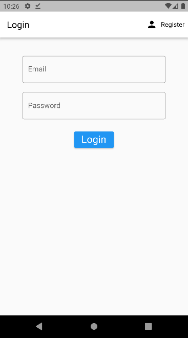
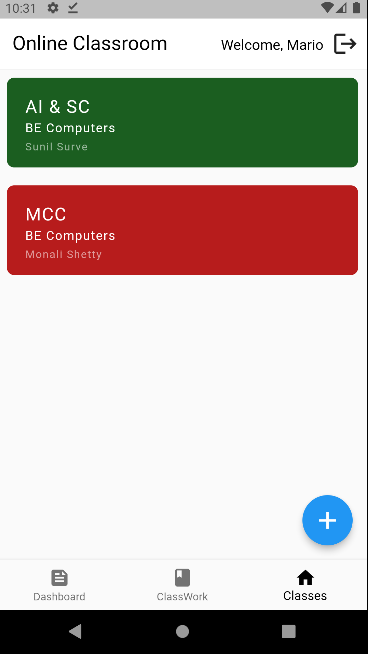
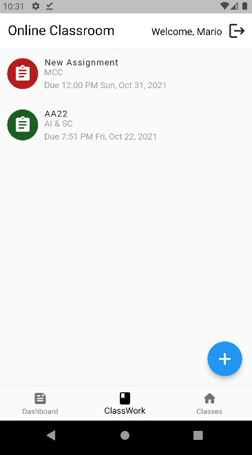
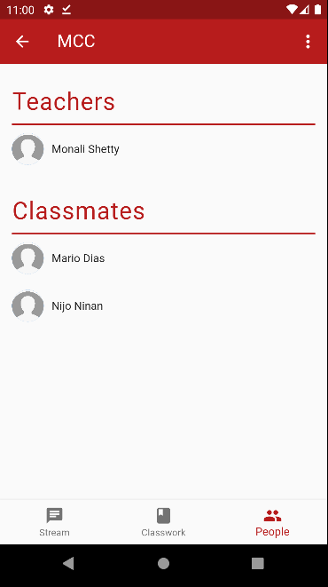
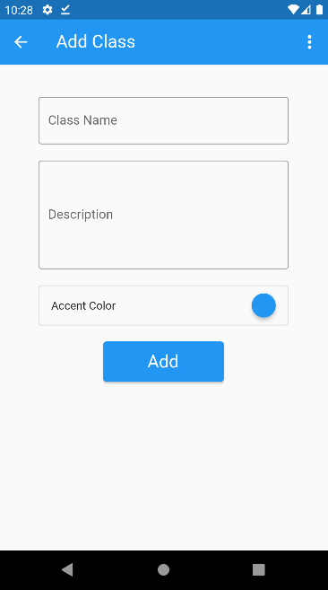
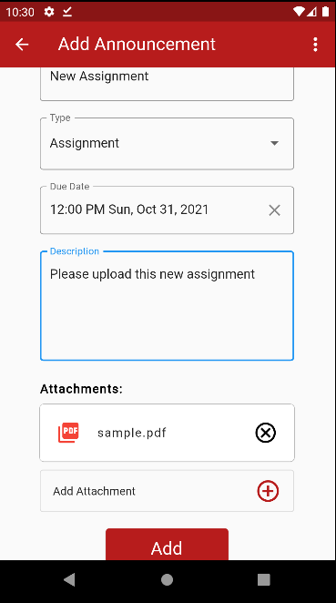
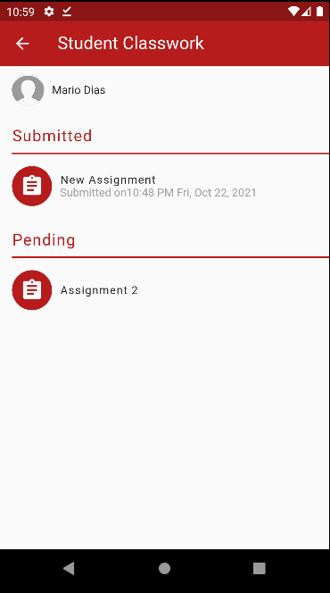
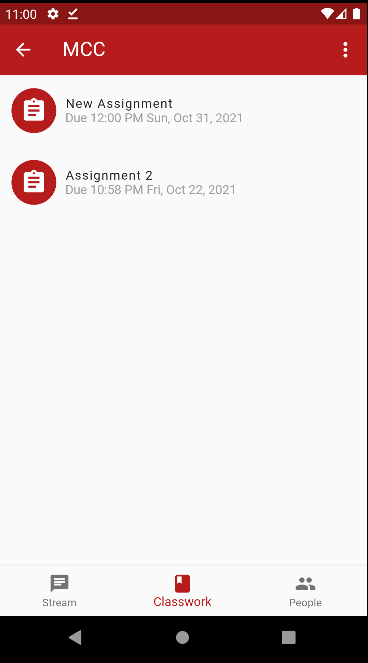
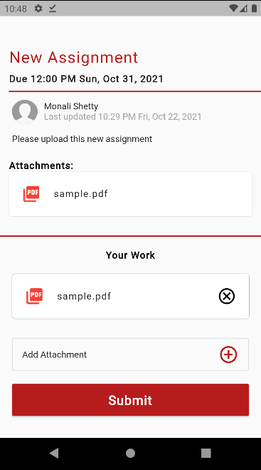

# Online Classroom Application using Flutter
An Online Classroom App developed using Flutter and Firebase that allows teachers to better communicate with students by posting updates and assignments along with timeline and deadline notifications. Students can join their respective classes and submit assignments directly and teachers will get information on all student submissions. Updates posted by teachers will be visible on the notification wall for all students. Both teachers and students have user accounts to store information regarding subjects, assignments and submissions. Teachers can also get a clear overview on the work done by each individual student and also regarding each assignment published.

### Requirements :
```
Flutter 
Android Studio  
Firebase Account
```

## Implemented Features:
- **Teacher Login/Register:**  
  As soon as you open the app, you will get an option to login using email id and password or register as a teacher
- **Student Login/Register:**  
  As soon as you open the app, you will get an option to login using email id and password or register as a student
- **Teachers can create new classes:**  
  Teachers get a feature wherein they can create as many classes as required
- **Students can join the class:**  
  Students can only join the classes provided they have the required class codes to do so
- **Teachers can create/update/delete the announcements/notices:**  
  For posting different instructions, announcements or notes, the teachers can add them using the provided button in each class. The teacher can also update or delete any announcement as and when required
- **Teacher can also add file attachments:**  
  Teachers can post the announcements and notes through different forms of files like pdfs, word documents, images, videos, etc.
- **Teachers can create/update/delete assignments:**  
  For receiving submissions from the students, teachers can add or create a section for assignments wherein students need to submit their work. The teacher can also edit or delete any assignment as and when required
- **Students can submit the assignments in the form of files:**  
Students can submit their assignments and tests through different forms of files like pdfs, word documents, images, videos, etc.
- **Notification panel to get all the updates at one place:**  
For the students to stay up to date with their classes, the notifications panel contains all the logs of the events that are created by the teachers
- **Teachers can view the details:**  
If a teacher wants to check the number of students in a particular class and their respective details, then she can get the information of all the students in her class like name and email id.

## References :  
https://docs.flutter.dev/cookbook  
https://github.com/AbhilashTUofficial/GoogleClassRoom-Clone-Flutter  
https://github.com/ganeshkarki/classroom  
https://github.com/ketanchoyal/Our-E-School  
https://github.com/Bobleyl/flutterfire_firestore  

## Screenshots:
|  |  |  |
|------|-------|-------|
|  |  |  |
|  |  |  |
